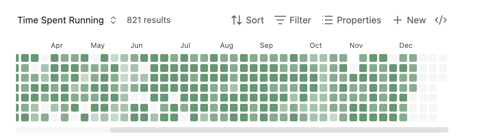

# Heatmap Bases View

A GitHub-contributions-style heatmap view for [Obsidian Bases](https://help.obsidian.md/bases). Visualize boolean or numeric properties from your daily notes over time.

**Requires Obsidian 1.10.0 or later** (Bases feature)



## Features

- Calendar heatmap visualization of note properties
- Support for boolean (checkbox) and numeric properties
- Parse dates from filenames (daily notes) or date properties
- Customizable color schemes (5 built-in, add your own in Settings)
- Light and dark theme support
- Configurable date ranges
- Click cells to open corresponding notes
- Keyboard navigation support

## Installation

### Manual Installation

1. Build the plugin (or download release files):
   ```bash
   npm install
   npm run build
   ```

2. Create a folder for the plugin in your vault:
   ```
   <YourVault>/.obsidian/plugins/heatmap-bases-view/
   ```

3. Copy these files to the plugin folder:
   - `main.js`
   - `styles.css`
   - `manifest.json`

4. Reload Obsidian (Ctrl/Cmd + R)

5. Enable the plugin in Settings > Community Plugins

## Usage

### Setting Up a Base with Heatmap View

1. **Create some daily notes** with a boolean or numeric property. For example, create notes named `2025-01-01.md`, `2025-01-02.md`, etc. with frontmatter:

   ```yaml
   ---
   exercise: true
   ---
   ```

   Or with numeric values:

   ```yaml
   ---
   mood: 7
   ---
   ```

2. **Create a new Base**:
   - Open the command palette (Ctrl/Cmd + P)
   - Search for "Create new base"
   - Give it a name like "Exercise Tracker"

3. **Configure the Base source**:
   - In the Base, click the filter icon or settings
   - Set the source folder to where your daily notes are stored (e.g., `Daily Notes/`)

4. **Switch to Heatmap view**:
   - Click the view switcher (usually shows "Table" by default)
   - Select "Heatmap" from the dropdown

5. **Configure the Heatmap**:
   - Click the settings/options for the view
   - **Date property**: Leave empty to parse dates from filenames, or select a date property
   - **Value property**: Select the property to visualize (e.g., `exercise` or `mood`)
   - Optionally configure color scheme, date range, and label visibility

### Example: Habit Tracker

Create daily notes with this frontmatter structure:

```yaml
---
meditated: true
exercise: false
water_glasses: 8
mood: 7
---
```

Then create separate Bases for each habit:
- "Meditation Tracker" → Value property: `meditated`
- "Exercise Tracker" → Value property: `exercise`
- "Hydration" → Value property: `water_glasses`
- "Mood" → Value property: `mood`

### Example: Using a Date Property

If your notes aren't named with dates, you can use a date property instead:

```yaml
---
date: 2025-01-15
completed: true
---
```

In the Heatmap settings:
- **Date property**: Select `date`
- **Value property**: Select `completed`

## Configuration Options

| Option | Description |
|--------|-------------|
| Date property | Property containing the date, or leave empty to parse from filename |
| Value property | Boolean or number property to visualize |
| Start date | Beginning of date range (YYYY-MM-DD), or leave empty for auto |
| End date | End of date range (YYYY-MM-DD), or leave empty for today |
| Color scheme | Select from available schemes (customize in Settings) |
| Week starts on | Sunday or Monday |
| Show weekday labels | Toggle Mon/Wed/Fri labels |
| Show month labels | Toggle month labels at top |

## Color Interpretation

- **Empty (hollow)**: No note exists for this date
- **Dim filled**: Note exists but value is false/0/missing
- **Colored intensity**: Note exists with positive value
  - For booleans: full intensity when true
  - For numbers: intensity scaled between min and max values

## Development

```bash
# Install dependencies
npm install

# Development build with watch mode
npm run dev

# Production build
npm run build

# Lint code
npm run lint

# Lint and auto-fix
npm run lint:fix
```

Linting runs automatically on staged files before each commit via husky pre-commit hooks.

### Releasing

See [RELEASING.md](RELEASING.md) for the complete release process and version management.

